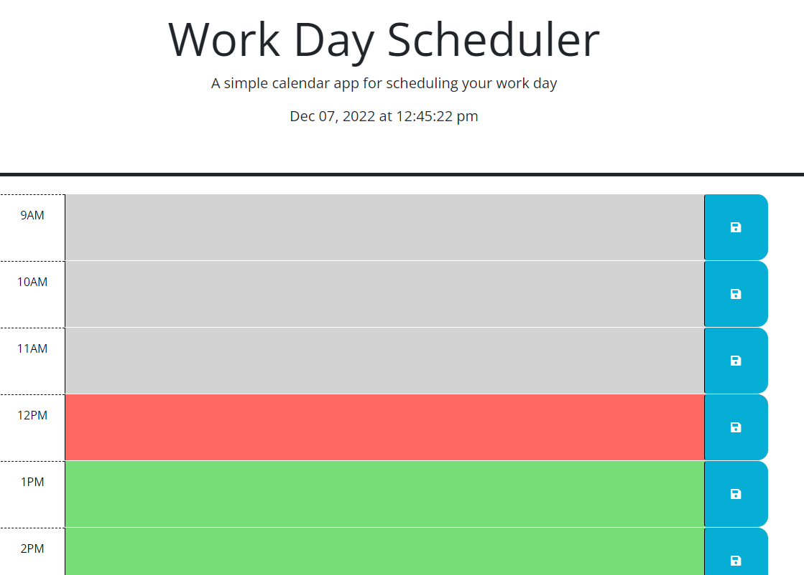

# workday-scheduler

## Description
This work day scheduler functions as a straightforward tool that will allow working professionals to organize their days according to their working hours. The application afforded the developer the opportunity to work with dayjs as a means of generating the current time and comparing that curren time against a given professional's inputted schedule.  

Site is now live and visible [here.](https://csanchezwagenbach.github.io/workday-scheduler/)

## Installation
No additional installations required, site can be accessed on any browser. 

## Usage

When the application loads, time blocks in grey have already passed that day, the time block in red represents the present hour, and the time blocks in green represent hours yet still to come. Users may enter into any of these color coded areas and type out what their agenda is for that hour. When a user clicks any of the save buttons to the right of the text areas, all text inside all time blocks will save and remain there upon a user reloading the page. Once a user clears the time blocks and saves that cleared block, then the schedule will clear. Current date and time may be viewed at the top of the page.

## License
MIT License

Copyright (c) 2022 Colby Sanchez Wagenbach

Permission is hereby granted, free of charge, to any person obtaining a copy
of this software and associated documentation files (the "Software"), to deal
in the Software without restriction, including without limitation the rights
to use, copy, modify, merge, publish, distribute, sublicense, and/or sell
copies of the Software, and to permit persons to whom the Software is
furnished to do so, subject to the following conditions:

The above copyright notice and this permission notice shall be included in all
copies or substantial portions of the Software.

THE SOFTWARE IS PROVIDED "AS IS", WITHOUT WARRANTY OF ANY KIND, EXPRESS OR
IMPLIED, INCLUDING BUT NOT LIMITED TO THE WARRANTIES OF MERCHANTABILITY,
FITNESS FOR A PARTICULAR PURPOSE AND NONINFRINGEMENT. IN NO EVENT SHALL THE
AUTHORS OR COPYRIGHT HOLDERS BE LIABLE FOR ANY CLAIM, DAMAGES OR OTHER
LIABILITY, WHETHER IN AN ACTION OF CONTRACT, TORT OR OTHERWISE, ARISING FROM,
OUT OF OR IN CONNECTION WITH THE SOFTWARE OR THE USE OR OTHER DEALINGS IN THE
SOFTWARE.
